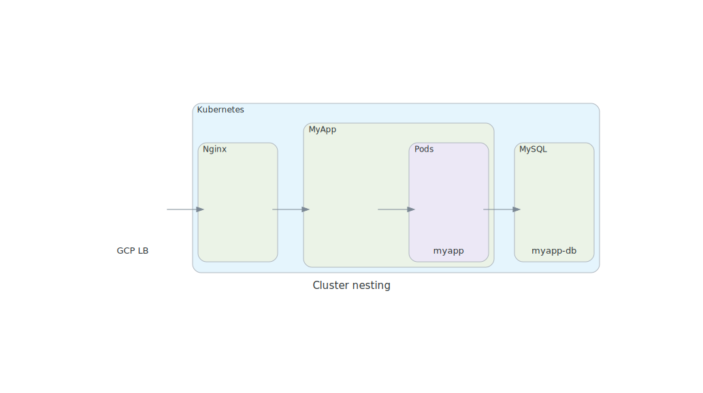
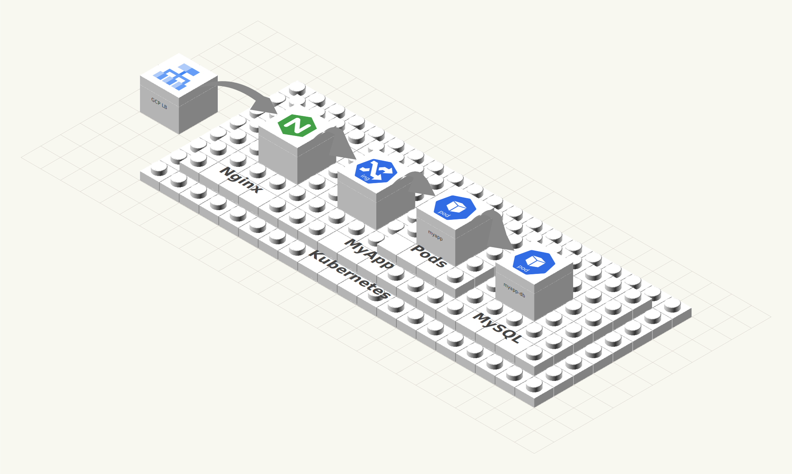

# ldr2svg

Convert architecture diagrams and LDraw brick scenes into clean, **editable** isometric SVG illustrations.

[](https://github.com/lbruand/bricksvg/actions/workflows/ci.yml)
[](LICENSE.md)
[](https://github.com/astral-sh/ruff)
[](https://github.com/astral-sh/ty)
[](https://www.python.org/)

## What it does

ldr2svg turns diagrams into isometric LEGO brick illustrations.
Each node becomes a coloured 2×2 brick, clusters become raised platforms,
and edges become arching arrows — all rendered as a single SVG you can
edit in Inkscape, LibreOffice Draw, or drop straight into Google Slides.

Three input formats are supported:

| Format | Tool | Example |
|--------|------|---------|
| **[diagrams](https://diagrams.mingrammer.com/)** Python scripts | `diagram2svg.py` | `diagram2svg.py arch.py` |
| **[Mermaid](https://mermaid.js.org/)** flowcharts (`.mmd`) | `mermaid2svg.py` | `mermaid2svg.py arch.mmd` |
| **LDraw / LeoCAD** (`.ldr`) brick scenes | `ldr2svg` | `ldr2svg scene.ldr` |

### Example transformation

<table>
<tr>
  <th>Input — diagrams-library output</th>
  <th></th>
  <th>Output — isometric brick SVG</th>
</tr>
<tr>
  <td></td>
  <td>→</td>
  <td></td>
</tr>
</table>

## Usage

### diagrams-library script → SVG

```bash
uv run python scripts/diagram2svg.py examples/arch.py -o arch_bricks.svg
```

### Mermaid flowchart → SVG

```bash
uv run python scripts/mermaid2svg.py examples/arch.mmd -o arch_bricks.svg
```

### LDraw scene → SVG

```bash
uv run ldr2svg scene.ldr
```

Outputs `scene.svg` alongside the input file.

## Requirements

### System dependencies

| Tool | Purpose | Install |
|------|---------|---------|
| [OpenSCAD](https://openscad.org/) | Render brick piece images | `sudo apt install openscad` |
| [Graphviz](https://graphviz.org/) | Lay out diagrams-library and Mermaid graphs (`dot`) | `sudo apt install graphviz` |
| [Xvfb](https://www.x.org/releases/X11R7.6/doc/man/man1/Xvfb.1.xhtml) | Virtual display for headless OpenSCAD | `sudo apt install xvfb` |

On macOS: `brew install openscad graphviz` (Xvfb not needed).

### Python

- Python 3.10+
- [uv](https://github.com/astral-sh/uv)

## Install

```bash
uv sync
```

## Development

```bash
uv run pytest test/ -m "not slow"   # fast unit tests (no OpenSCAD needed)
uv run ruff check ldr2svg/ test/    # lint
uv run ty check ldr2svg/            # type check
```

Slow integration tests (require OpenSCAD; use `xvfb-run` on headless systems):

```bash
xvfb-run uv run pytest test/ -v
```

## How to import your SVG into Google Slides

 1. Load the SVG into a LibreOffice presentation (tested on LibreOffice 24.2.7.2)
 2. Click the image → contextual menu → **Break the SVG**
 3. Save as `.pptx` (Microsoft PowerPoint 2007+)
 4. Upload the `.pptx` into Google Slides

## Credits and licences

- **`ldr2svg/brick.scad`** — derived from [Thingiverse thing:5699](http://www.thingiverse.com/thing:5699),
  © 2015 Christopher Finke, MIT licence.
  LEGO, the LEGO logo, the Brick, DUPLO, and MINDSTORMS are trademarks of the LEGO Group.

- **LDraw** — part geometry and colour definitions follow the
  [LDraw](https://www.ldraw.org/) open standard for LEGO CAD programs.
  LDraw™ is a trademark of the Estate of James Jessiman.
