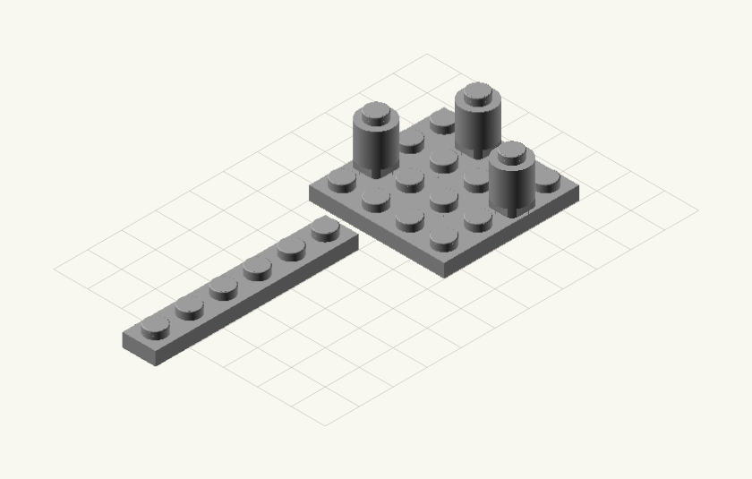

# ldr2svg

Render LDraw/LeoCAD (`.ldr`) scenes to clean isometric SVG LEGO illustrations.

[](https://github.com/lbruand/bricksvg/actions/workflows/ci.yml)
[](https://github.com/astral-sh/ruff)
[](https://github.com/astral-sh/ty)
[](https://www.python.org/)



## Usage

```bash
uv run ldr2svg scene.ldr
```

Outputs `scene.svg` alongside the input file.

## Requirements

- Python 3.10+
- [OpenSCAD](https://openscad.org/) (for rendering piece images)
- [uv](https://github.com/astral-sh/uv)

## Install

```bash
uv sync
```

## Development

```bash
uv run pytest test/ -m "not slow"   # fast unit tests
uv run ruff check ldr2svg/ test/    # lint
uv run ty check ldr2svg/            # type check
```

Slow integration tests (require OpenSCAD):

```bash
uv run pytest test/ -v
```
